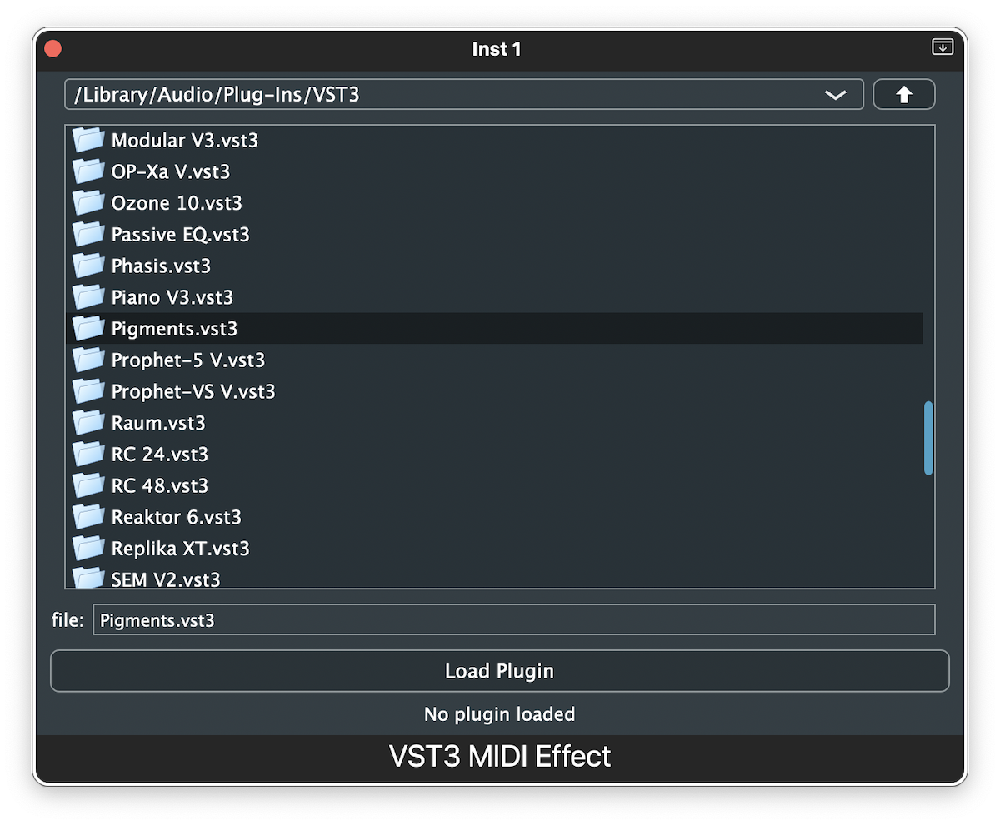

# Motivation

We sometimes want to use MIDI output of a synth as MIDI input to another synth. That way we can, for example, generate MIDI with Arturia Pigments' fantastic sequencer and  send its output to various instruments to achieve musically interesting results. The way this is done in most DAWs is by routing MIDI output of a VST3 instrument to another track.

AU plugins can also output MIDI, as mentioned in [WWDC2017 session number 501](https://devstreaming-cdn.apple.com/videos/wwdc/2017/501fo36iwi2moz2l222/501/501_whats_new_in_audio.pdf):
 
 
>AU can emit MIDI output synchronized with its audio output
>
> Host sets a block on the AU to be called every render cycle
>
> Host can record/edit both MIDI performance and audio output from the AU
 

However, very few hosts capture MIDI output of AU instruments. Logic certainly doesn't. Arturia Pigments AU does produce MIDI, but that MIDI can't go anywhere from Logic's instrument slot.

On the other hand, AU specification and SDK does offer the official way to create actual MIDI plugins for sample-accurate MIDI transformation, which is not the case with VST3. By only changing a few lines of code, AU developers can build a MIDI FX version of their plugins that could be used as MIDI effects in Logic. But very few of them do it, for whichever reason. Furthermore, many AU instruments do not even produce MIDI, even when their VST3 versions do.

One possible solution to this problem is to host a VST3 externally and send its MIDI output to Logic vis *IAC* or *Logic Virtual In* MIDI port. A small problem with this approach is the loss of sample accuracy, but that rarely matters in practice. A bigger problem is that we need a way to synchronise Logic's clock with the external host's clock, which is doable in few ways, but not trivial.

A better way is to host a VST3 inside an audio unit in a MIDI FX slot in Logic. This allows VST3 to be used with all the benefits of native MIDI FX plugins. There are already a few products on the market that allow for this and much more ([Blue Cat's PatchWork](https://www.bluecataudio.com/Products/Product_PatchWork/), [Plogue Bidule](https://www.plogue.com/products/bidule.html) etc.), but those products are usually relatively complex and intended for building modular setups. I needed a very simple solution for hosting a single VST3 unit as MIDI effect in Logic, without any additional features or complexity. So, I made a minimalistic wrapper in JUCE. It only has a file browser for choosing a VST3 file. After the VST3 is loaded, its own editor is used as if it was a native AU. Below is a screenshot of the file browser interface and an example where Arturia Pigments is used as a MIDI FX for Studio Strings in Logic.

This repository also contains instrument and audio FX versions of the wrapper, but hosting VST3s as instruments or effects in Logic is not that useful. I do that only in rare cases when an Audio Unit version of an instrument or effect has some bug not present in the VST3 version.

# Disclamer

I am neither C++ nor audio plugin developer. This is my first ever C++ project and the product is intended for personal use. Don't use this code uncritically. It's probably far from the best practices. And the plugin it's not thoroughly tested. But the worst thing that can happen is that it doesn't work properly in some scenarios or that it crashes here and there. If you use Logic on Apple Silicon, plugin crash won't crash the Logic itself. So it's safe to try it. If it works for you great! If not, you can try to fix it or improve it. :)

# Building the Projects

The repo contains 3 Projucer projects, one for MIDI FX, one for Instrument and one for Audio FX AU. Those projects share the source code, but have to be built separately. To build each project, download [JUCE framework](https://juce.com) (version 7) and [Xcode](https://developer.apple.com/xcode/) (15 or higher). Generate Xcode project from each Projucer project (as explained [here](https://docs.juce.com/master/tutorial_new_projucer_project.html)) and build it. The resulting AU plugin should be automatically installed to an appropriate location where Logic can find it. You can also export an archive from Xcode project and install it manually. If you want to distribute plugins to other computers, you must sign them with Apple developer certificate and notarize it.

# Channel Layout Support

The instrument and effect wrappers theoretically support every possible channel layout that Logic supports, including surround and multi-output for instruments, surround and multi-mono for effects and sidechain for both. However, it can be sometimes tricky to make multi-output VST3 instruments load and work properly. I did eventually make multi-output Kontakt 7 work, but I needed to create the appropriate channels in advance in Kontakt standalone and save that layout as the default before the multi-output instance of the wrapper could open it.
